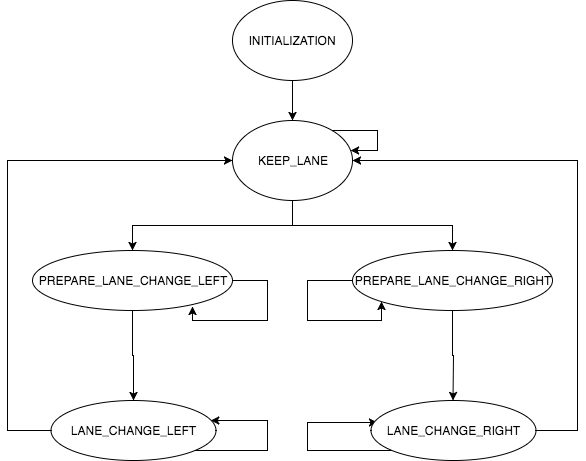

# Path Planning Project
[](http://www.udacity.com/drive)

This project implements a path planning algorithm to safely navigate around a virtual highway with other traffic.  The vehicle keeps inside its lane, avoids hitting other cars, and passes slower moving traffic by using localization, sensor fusion, and map data. 


## Dependencies
* cmake >= 3.5
 * All OSes: [click here for installation instructions](https://cmake.org/install/)
* make >= 4.1
  * Linux: make is installed by default on most Linux distros
  * Mac: [install Xcode command line tools to get make](https://developer.apple.com/xcode/features/)
  * Windows: [Click here for installation instructions](http://gnuwin32.sourceforge.net/packages/make.htm)
* gcc/g++ >= 5.4
  * Linux: gcc / g++ is installed by default on most Linux distros
  * Mac: same deal as make - [install Xcode command line tools]((https://developer.apple.com/xcode/features/)
  * Windows: recommend using [MinGW](http://www.mingw.org/)
* [uWebSockets](https://github.com/uWebSockets/uWebSockets)
  * Run either `install-mac.sh` or `install-ubuntu.sh`.
  * If you install from source, checkout to commit `e94b6e1`, i.e.
    ```
    git clone https://github.com/uWebSockets/uWebSockets 
    cd uWebSockets
    git checkout e94b6e1
    ```
* Simulator. You can download these from the [releases tab](https://github.com/udacity/self-driving-car-sim/releases).

## Basic Build Instructions
1. Clone this repo.
2. Make a build directory: `mkdir build && cd build`
3. Compile: `cmake .. && make`
4. Run it: `./mpc`.

# Project Goals and [Rubric](https://review.udacity.com/#!/rubrics/1020/view)
The goals of this project are the following:

* The car is able to drive at least 4.32 miles without incident
* The car drives according to the speed limit
* Max Acceleration and Jerk are not Exceeded
* Car does not have collisions
* The car stays in its lane, except for the time between changing lanes
* The car is able to change lanes

## Software Modules

### CoordinateUtils
The utils file provides basic functions to convert angles from degree to rad, velocity from mps to mph, map coordinates to Frenet coordinates and vice versa.

### Vehicle Class
The `Vehicle` class encapsulates the vehicle attributes like the unique ID, the absolute velocity, the x- and y-velocity, the actual position in map (x, y) and Frenet (s, d) coordinates, the yaw, the vehicle's width and the actual driving lane.  Also, the class provides methods to predict the vehicle trajectory.

### VehicleController Class
The `VehicleController` class manages all detected vehicles, the ego vehicle and the speed limits per lane.  It calculates the average lane velocity as well as the lane occupancy (number of vehicle driving ahead per lane).  Finally, the class provides methods to update and clean-up the `Vehicle` list, to determine the next vehicle driving ahead or behind the ego vehicle for a specific lane and methods to identify the fastest lane and the fastest reachable lane.  Fastest reachable lane means the next left or right line.

#### Tuning Parameters

The `VehicleController` class can be tuned by the following parameters.
``` C++
static constexpr double LANE_WIDTH = 4.0; // default lane width
static constexpr double MAX_DISTANCE_FOR_AVE_VELOCITY = 100; // The average velocity is calculated for vehicles in range of x m ahead
```

### LaneStateController Class
The `LaneStateController`class suggests the next feasible, safe, legal and most efficient maneuver (state) like e.g. keep lane, prepare for left lane change, change the lane to the left, etc.  It does not consider the detailed trajectory.  This is typically the task of the path planner.

#### LaneState FSM (Finite State Machine)
The next maneuver is defined by the following lane states.  Depending on the actual state, the `LaneStateController` determines the target velocity and the target lane.  With these inputs (state, target velocity and target lane) the `PathPlanner` plans an optimal and jerk free trajectory.

| State                      | Description                                                                                                               | Next State                                                        |
|:---------------------------|:--------------------------------------------------------------------------------------------------------------------------|:-------------------------------------------------------------------|
| `INITIALIZATION`           | Initialization phase of the behavior planner.                                                                             | -KEEP_LANE                                                          |
| `KEEP_LANE`                | The ego vehicle keeps the lane as long as the target velocity could be keep and a faster lane is not available.           | -KEEP_LANE<br/>-PREPARE_LANE_CHANGE_LEFT<br/>-PREPARE_LANE_CHANGE_RIGHT |
| `PREPARE_LANE_CHANGE_LEFT` | The ego vehicle prepares for a left lane change (e.g. adjusting velocity to target lane, waiting for a safe gap, etc.).   | -PREPARE_LANE_CHANGE_LEFT<br/>-LANE_CHANGE_LEFT                       |
| `LANE_CHANGE_LEFT`         | The ego vehicle starts to change to the left adjacent lane.                                                               | -LANE_CHANGE_LEFT<br/>-KEEP_LANE                                      |
| `PREPARE_LANE_CHANGE_RIGHT`| The ego vehicle prepares for a right lane change (e.g. adjusting velocity to target lane, waiting for a safe gap, etc.).  | -PREPARE_LANE_CHANGE_RIGHT<br/>-LANE_CHANGE_RIGHT                     |  
| `LANE_CHANGE_RIGHT`        | The ego vehicle starts to change to the right adjacent lane.                                                              | -LANE_CHANGE_RIGHT<br/>-KEEP_LANE                                     |



#### Tuning Parameters

The `LaneStateController` class and the `LaneState` FSM state transitions can be tuned by the following parameters.
``` C++
static constexpr double LOWER_TIME_GAP = 1.5; // min allowed time gap to vehicle ahead [s]
static constexpr double UPPER_TIME_GAP = 3.5; // time gap [s] to drive with speed limit
static constexpr double MIN_TIME_GAP_INIT_LANE_CHANGE = 3.0; // min allowed time gap to initiate a lane change [s]
static constexpr double MIN_TIME_GAP_LANE_CHANGE = 1.0; // min required time gap to vehicle in target lane [s]
static constexpr double MIN_DISTANCE_FRONT_LANE_CHANGE = 10.0; // min required distance to vehicle ahead in target lane [m]
static constexpr double MIN_DISTANCE_REAR_LANE_CHANGE = 10.0; // min required distance to vehicle behind in target lane [m]
static constexpr double MIN_TTC_FRONT_LANE_CHANGE = 6.0; // min required time-to-collision to vehicle ahead in target lane [s]
static constexpr double MIN_TTC_REAR_LANE_CHANGE = 6.0; // min required time-to-collision to vehicle behind in target lane [s]
static constexpr double FASTEST_LANE_FACTOR = 0.08; // the fastest lane velocity need to  be x% faster than the current [%]
```
### PathPlanner Class
The `PathPlanner` class determines the optimal, jerk free and drivable trajectory to realize the desired behavior (state, target velocity and target lane) provided by the `LaneStateController` class. To stabilize the trajectory the simulator provides the "not driven part" of the previous trajectory. The spline based trajectory is calculated based on the following processing steps.

1. Determine 5 reference (anchor) points in Frenet space
 * If less then 2 points of the previous trajectory are available, determine two points as tangent to the ego vehicle. Otherwise take the last two points from the previous trajectory.
 * Add three waypoints located at the center of the target lane in 30 m, 60 m and 90 m distance.
2. Smooth the trajectory by fitting a spline through all reference (anchor) points in Frenet space.
3. Add points from the previous to the new trajectory.
4. Fill up the new trajectory (up 50 points) along the spline and transform them into map coordinates.
 * The distance between two consecutive points specifies the ego vehicles's velocity.  In order to calculate a trajectory within the jerk and acceleration limits, the distance is adjusted continuously by increasing/decreasing the reference velocity by `MAX_DELTA_VELOCITY` up/down to the target velocity.

#### Tuning Parameters
The optimal trajectory can be tuned by the following parameters.
```C++
static constexpr double SPEED_LIMIT = 49.5 * 0.44704; // max allowed speed [m/s]
static constexpr double CONTROLLER_CYCLE_TIME = 0.02; // Cycle time of the vehicle controller between two trajectory points [s]
static const int TOTAL_PREDICTION_POINTS = 50; // number of prediction points for e.g. the trajectory planner or vehicle model

static constexpr double MAX_DELTA_VELOCITY = 0.09; // Max delta velocity [m/s] between two waypoints to guarantee accelerations < 10 m/s2 jerks < 10 m/s3
static constexpr double MIN_TIME_GAP = 2.0; // min allowed time gap to vehicle ahead [s]
static constexpr double MIN_TIME_GAP_LANE_CHANGE = 1.0; // min allowed time gap to vehicle ahead/behind during a lane change [s]
```

# Results
After some tinkering, my implementation runs well enough to get around the track and fulfill the rubric goals.

[Link to project video](https://youtu.be/vvReZ0varZc)

# Lessons Learned
It would be interesting to try a **cost function** for determining state transitions and not just heuristics from the vehicle controller.


